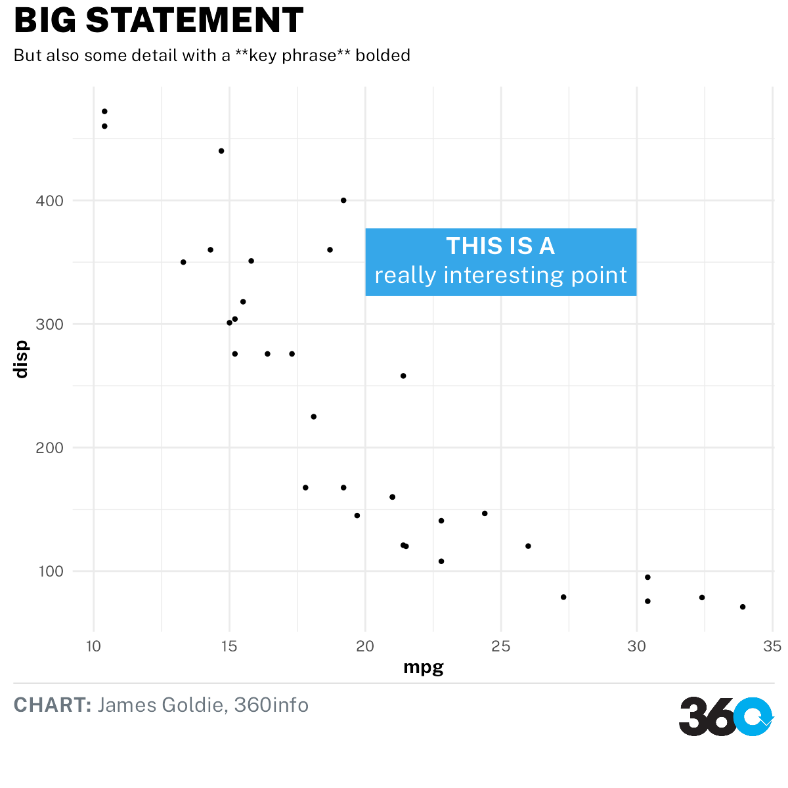

<!-- README.md is generated from README.Rmd. Please edit that file -->

```{r, include = FALSE}
knitr::opts_chunk$set(
  collapse = TRUE,
  comment = "#>",
  fig.path = "man/figures/README-",
  out.width = "100%"
)
```

# themes360info
Helpers for creating graphics with ggplot2 that align with 360info style guides

<!-- badges: start -->
[](https://lifecycle.r-lib.org/articles/stages.html#stable)
<!-- badges: end -->

# Installation

Install the package from GitHub with the `remotes` or `devtools` packages:

```r
remotes::install_github("360-info/themes360info")
```

## Use

To create plots in our style:

* Add `themes360info::theme_360` to your ggplot2 plot;
* Add our fonts to other elements, like annotations or additional theme customisations (see the ["Working with fonts" article](articles/articles/working-with-fonts.html));
* Get brand colours using `themes360info::colours_360`;
* Add text annotations to plots with `themes360info::annotate_360` and other helpers;
* Save the plot, adding a footer with the 360 logo, using `themes360info::save_360plot`

```{r demo}
library(ggplot2)
library(themes360info)

myplot <- ggplot(mtcars) +
  aes(mpg, disp) +
  geom_point() +
  annotate_360_lightblue(x = 25, y = 350,
    label = "**THIS IS A**<br>really interesting point") +
  theme_360() +
  labs(
    title = "BIG STATEMENT",
    subtitle = "But also some detail with a **key phrase** bolded",
    caption = "**CHART:** James Goldie, 360info")

save_360plot(myplot, "man/figures/README-demo.png")

```

## Help

Please feel free to [get in touch](https://github.com/360-info/themes360info/issues/new) if you have problems with the package or would like to suggest new features.
