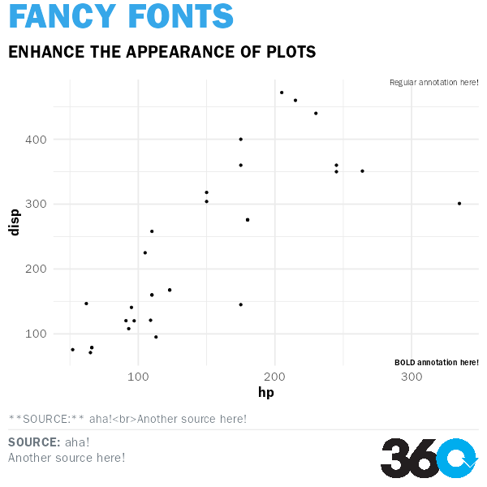

<!-- README.md is generated from README.Rmd. Please edit that file -->

# themes360info

Helpers for creating graphics with ggplot2 that align with 360info style
guides

<!-- badges: start -->
<!-- badges: end -->

# Installation

First, [download the Libre Franklin
fonts](https://fonts.google.com/specimen/Libre+Franklin) and install
them.

Then install the development version with:

``` r
remotes::install_github("360-info/themes360info")
```

## Fonts

360info uses ITC Franklin Gothic Std and Libre Franklin for its internal
style. At least one of these should be installed on the system. When you
load the package, three font families will be registered for use in your
plots:

-   `"Headline 360info"` is for use in headlines, titles and very large
    annotations (including cases where an annotation is used instead of
    a title);
-   `"Subhead 360info"` is for use in subtitles and secondary or
    medium-sized annotations;
-   `"Body 360info"` is for use in small annotations and other plot
    elements. It has normal and bold variants; use the latter for
    emphasis in labels and important but small textual plot elements.

`theme_360info()` already uses these fonts by default (unless you supply
a different `base_family` or override specific theme elements), but if
you add text-based labels or annotations outside the theme system (eg.
using `geom_label`), you’ll need to supply one of these font families:

``` r
library(ggplot2)
library(ragg)
library(themes360info)

# use this to temporarily switch to either itc franklin gothic or libre franklin
register_360fonts("libre", TRUE)
#> ✔ Using preferred font, Libre Franklin.
#> ℹ Specify a different font to use with 360info themes by calling
#>   register_360fonts() or by setting options("themes360info.franklin") to either
#>   "itc" or "libre" (or "none" to disable automatic font loading).
#> NULL

test_path <- knitr::fig_path(".png")
agg_png(test_path, width = 1200, height = 600, units = "px", res = 120)

ggplot(mtcars) +
  aes(hp, disp) +
  geom_point() +
  # this text annotation uses the regular weight body font
  geom_text(
    aes(Inf, Inf, label = "Regular annotation here!"),
    hjust = "inward", vjust = "inward",
    family = "Body 360info") +
  # this text annotation uses the bold weight body font
  geom_text(
    aes(Inf, -Inf, label = "BOLD annotation here!"),
    hjust = "inward", vjust = "inward",
    family = "Body 360info", fontface = "bold") +
  labs(title = "FANCY FONTS", subtitle = "ENHANCE THE APPEARANCE OF PLOTS") +
  # this adds our fonts, colours and other preferences to the rest of the plot
  theme_360info()

invisible(dev.off())
knitr::include_graphics(test_path)
```



### Choosing a preferred font

When you load `themes360info`, one of these (ITC Franklin Gothic Std by
default) will be loaded for use. You can switch fonts temporarily by
calling `register_360fonts()`, or you can configure the package to
prefer one or the other on a per-project or global basis by setting
`options("themes360info.franklin") <- "itc"` in your project script or
`.Rprofile`. Acceptable options for either function are:

-   `"itc"`: Prefer ITC Frnaklin Gothic Std
-   `"libre"`: Prefer Libre Frnaklin
-   `"none"`: do not load fonts with the package (ideal if you plan to
    manually register fonts yourself)

Registering fonts will make three font families available for use in
plots:

## Next features

text formatting with `ggtext`:

``` r
# not working yet!
# p2 <- p1 +
#   textbox_360info("blue",
#     x = Inf, y = Inf, hjust = "inward", vjust = "inward", halign = 1,
#     label = "**THIS IS A PATTERN**<br>As one measure gets bigger, the other gets smaller."
#   )
# ggsave("test2.png", p2)
```
