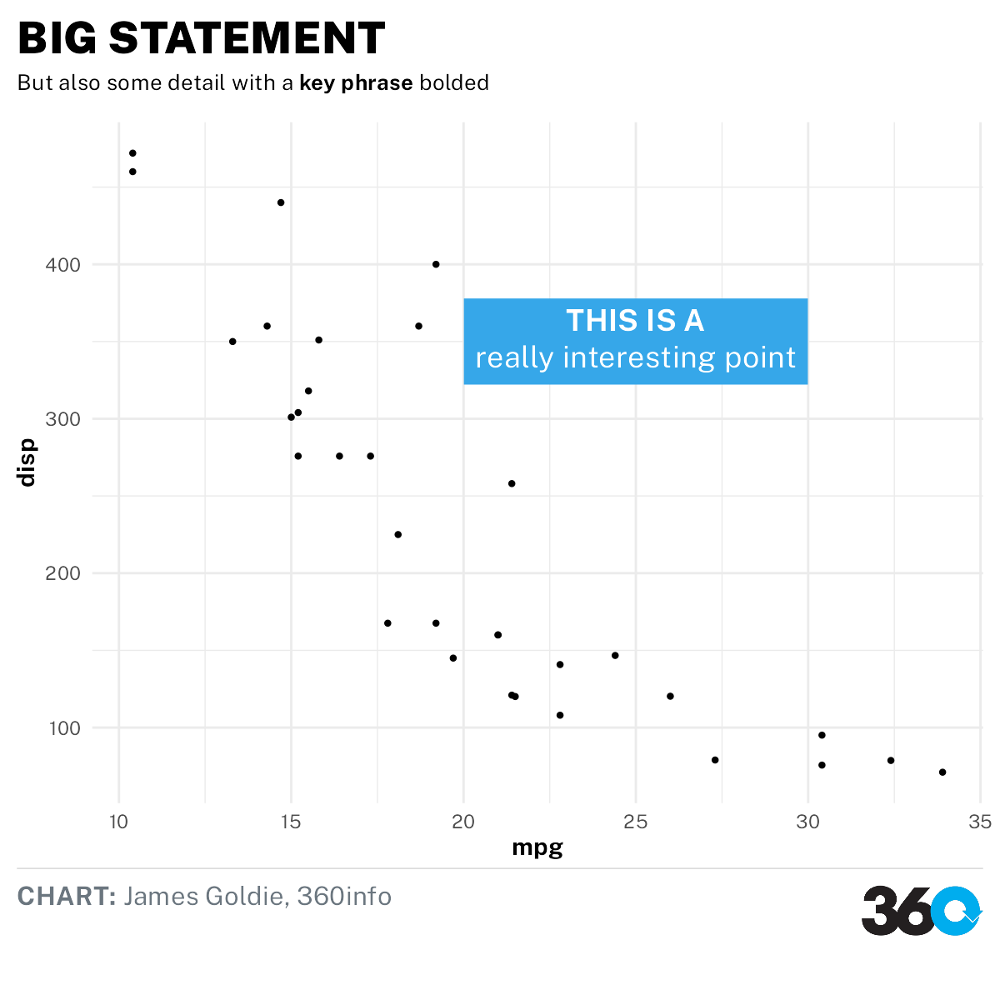

<!-- README.md is generated from README.Rmd. Please edit that file -->

# themes360info

Helpers for creating graphics with ggplot2 that align with 360info style
guides

<!-- badges: start -->

[](https://lifecycle.r-lib.org/articles/stages.html#experimental)
<!-- badges: end -->

# Installation

First, download and install either the [Libre Franklin
fonts](https://fonts.google.com/specimen/Libre+Franklin) or the [ITC
Franklin Gothic
fonts](https://www.myfonts.com/fonts/itc/franklin-gothic/) and install
them.

Then install the package with:

``` r
remotes::install_github("360-info/themes360info")
```

## Use

To create plots in our style:

-   Add `themes360info::theme_360` to your ggplot2 plot;
-   Add our fonts to other elements, like annotations or additional
    theme customisations (see the [“Working with fonts”
    article](articles/articles/working-with-fonts.html));
-   Get brand colours using `themes360info::colours_360`;
-   Add text annotations to plots with `themes360info::annotate_360` and
    other helpers;
-   Save the plot, adding a footer with the 360 logo, using
    `themes360info::save_360plot`

``` r
library(ggplot2)
library(themes360info)

myplot <- ggplot(mtcars) +
  aes(mpg, disp) +
  geom_point() +
  annotate_360_lightblue(x = 25, y = 350,
    label = "**THIS IS A**<br>really interesting point") +
  theme_360() +
  labs(
    title = "BIG STATEMENT!",
    subtitle = "BUT ALSO SOME DETAIL",
    caption = "**CHART:** James Goldie, 360info")

save_360plot(myplot, "man/figures/README-demo.png")

```


## Help

Please feel free to [get in
touch](https://github.com/360-info/themes360info/issues/new) if you have
problems with the package or would like to suggest new features.
